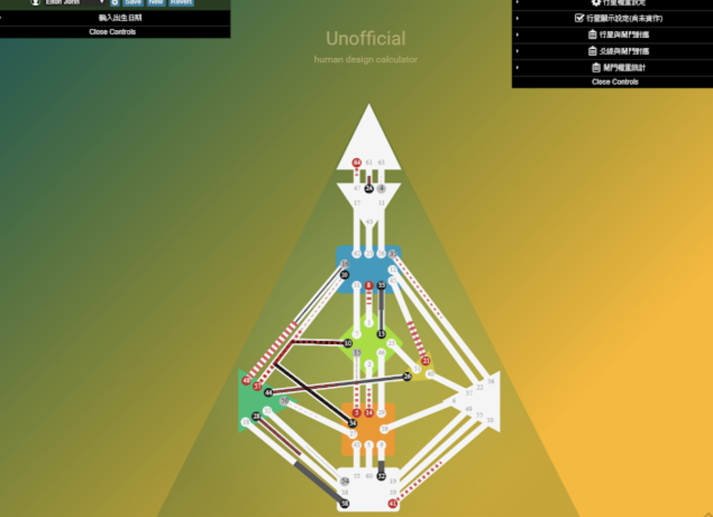

## Simple Humandesign Calculator - front end
只包含前端部份，2017年寫完就不再維護，結構混亂，年代久遠(js+flow-type)，待更新。 後台 [backend] 由 python 使用 pyephem 提供的科學計算得出所有天體資料，再由前端 render 成.



找到右側統計資料，可看到小行星，若要找上昇下降的閘門，往下拉到底，找到 sunrise/sunset便是，右側有行星權重設定，反應在通道上時，線條粗細會改變，小行星預設0.1，因此線條很細，凱龍0.5，背後的計算是用pyephem寫的，南北交算法是用True Node 也就是真實月交點，一般占星網站用的是平均月交點，所以算出來有些人的南北交星座會和占星網站不一樣，之所以用真實月交點是因為人類圖軟體似乎也是用真實月交點計算。

design date的算法是從出生日期往前算88個太陽度，算法上是用迴圈逼近的，所以精度可能不會有maya mechanic軟體好。可輸入許多人的生日，但這些資料是存在自己的電腦上，也就是如果電腦重灌或browser cache 清除以後就會消失。

__dependencies:__
 - quasar framework
 - flow-typed
 - paperjs

__install:__
> 太舊使用 js/flow-type 及舊的 babel，目前無法安裝
```bash
npm install
npm run build
```


[screen1]: src/assets/hd_screenshot.png
[screen2]: src/assets/hd_screenshot_b.png
[screen3]: src/assets/hd_screenshot_c.png
[backend]: https://github.com/gordianknotC/humandesign_backend_python


